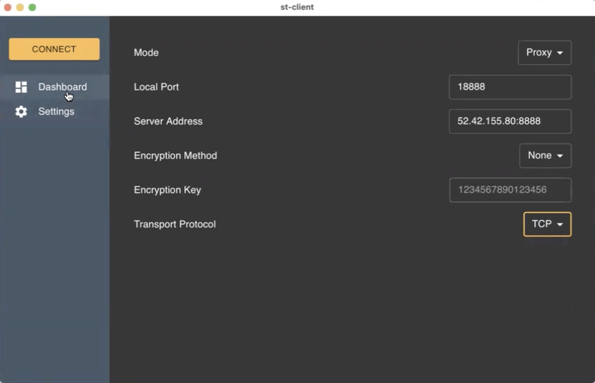

<!-- PROJECT LOGO -->
<p align="center">
   
</p>

<!-- ABOUT THE PROJECT -->

## About The Project

**ShadowTunnel** is a socks5 proxy designed to bypass any potential network blockage and censorship to make internet browsing safer.

### Key Features

- **C/S model**: The proxy client is lisening and intercepting the local trafic and forwarding them the the proxy server; The proxy server is listening to the requests from the cients and initiating requests to the actual server.
- **Data obfuscation**: Socks5 is basically transparent which is easy to detect by firewalls. We obfuscate the raw socks5 request by wrapping it in a fake HTTP header to pretend this is a normal HTTP request.
- **Data encryption**: Data encryption is essential since we don’t want anyone else to look at our traffic. User can choose a encryption method to protect their privacy.
- **QUIC support**: Socks5 originally use TCP or UDP as the transport layer protocol, besides that, we can switch to QUIC to gain better performance and better security of the proxy.
- **Dispatching traffic based on config**: To better hide our proxy and to reduce the loads on the proxy, we can use a config file to store the rules on whether the traffic should be sent to the proxy or directly sent to the actual server.

<p align="center">
   
</p>


<p align="center">
   
</p>
<p align="center">
   
</p>

## 🚚 Project Structure

```
/
├── st-client/
│   ├── build/
│   ├── frontend/
│   ├── app.go
│   ├── wails.json
│   └── main.go
└── st-server/
    └── main.go
```

- `st-client` is a desktop app built with Go, React and Wails. The client listens and intercepts local traffic on a specific port and forwards them to the proxy server after encryption.
    - `/frontend/` - Frontend project files
    - `/build/` - Project build directory
    - `/app.go` - Methods exposed to front end
    - `/main.go` - The main application
    - `/wails.json` - The project configuration
- `st-server` is the proxy server that receives requests from clients, decrypts messages, and initializes messages to the actual server.
    - `/main.go` - The main application


### Built With

- GO
- React
- Wails
- Typescript
- MaterialUI